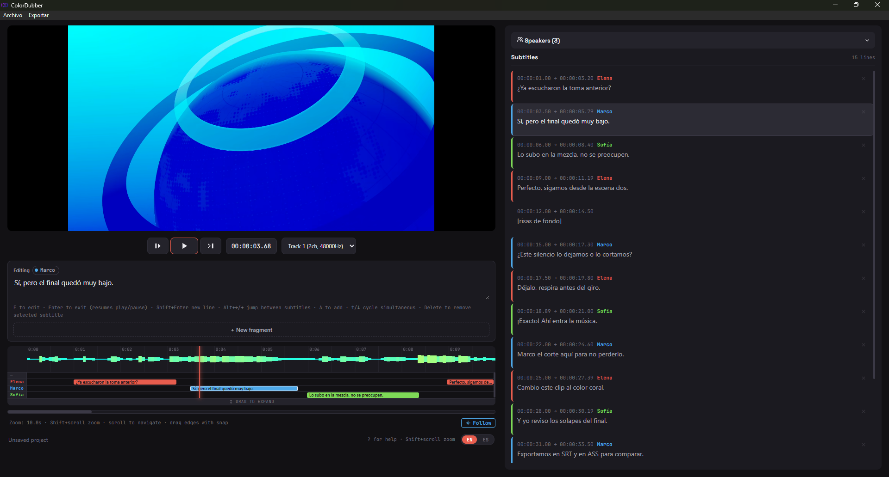

# OpenDialogue


Visual multi-speaker subtitle editor and color-coding companion for [auto-subs](https://github.com/tmoroney/auto-subs). Import its SRT+TXT, assign each speaker their color on a per-speaker lane timeline, and export clean SRT, styled ASS, or JSON.

> **⚠️ Transparency — heavy AI assistance:** this project was built with **heavy LLM assistance** for architecture, Rust/React implementation and debugging (canvas, waveform, subtitle formats). The author (1st-semester Systems Engineering student) understands the high-level flow, but **large parts of the codebase are not yet fully understood line-by-line by the author**. It is published honestly as a learning project and as a reference that might be useful to others. **Current plan:** deeply study each part (React canvas loop, Tauri IPC, timeline, state handling) and **progressively rewrite/refactor all code with full personal understanding**. Issues and PRs pointing out confusing or improvable code are welcome — they help that learning.

## Screenshots



> See the approved design study in [`design/mockup.html`](design/mockup.html) (tokens, typography, per-speaker timeline).

## Features

- **Per-speaker timeline** — one lane per speaker, HTML clips with real subtitle text, overlapping clips stacked with natural z-index.
- **Waveform** — prerendered canvas scaled by `devicePixelRatio`, time grid and coral playhead with halo.
- **Multi-selection** — click, Ctrl+click (toggle), Shift+click (time-range), marquee on the track area, virtualized list selection.
- **Editing** — block body-drag with snap and edge auto-pan, edge trim, split at playhead, undo snapshots.
- **ASS export** — styled `.ass` with per-speaker presets (font, size, colors, outline, margins, alignment), system font picker, round-trip import.
- **auto-subs import** — pick the SRT, the twin TXT is found automatically (same folder/name). Speakers matched by text, accent/punctuation tolerant.
- **Audio islands** — new fragments snap to the optimal dialogue length (1.5–5s) from RMS vs local background noise.
- **Persistence** — `.json` projects with playhead, volume cache, atomic writes.

## Stack

| Layer | Technology |
|-------|------------|
| Desktop | Tauri v2 (Rust + WebView) |
| Frontend | React 19, TypeScript, Vite 7, Vitest 4 |
| Styles | CSS design tokens (`:root`), local fonts `Space Grotesk` / `JetBrains Mono` / `Inter` |
| Backend | Rust, `symphonia` (volume analysis), `tokio` (async commands) |
| Audio | The video's own audio track (single-track files; pre-edit to dialogue only) |
| Fonts (ASS picker) | GDI+ via PowerShell on Windows, `fc-list` (fontconfig) on Linux |

> Former AI era (until 2026-09-20): local Whisper (`whisper-rs`/Vulkan) + `polyvoice` diarization, later a `pyannote` external-Python option. Cut on purpose: transcription belongs to auto-subs; this app is its visual companion.

## Prerequisites

### Windows

- **Rust** toolchain (`rustup`)
- **Node.js** 20+ and npm
- **Visual Studio Build Tools** with C++ workload (MSVC)

### Linux (verified on Fedora 44 KDE)

- **Rust** toolchain (`rustup`), **Node.js** 20+ and npm
- WebView build deps (Fedora): `webkit2gtk4.1-devel gtk3-devel libsoup3-devel librsvg2-devel libayatana-appindicator-gtk3-devel`
- Equivalents on Debian/Ubuntu: `libwebkit2gtk-4.1-dev build-essential curl wget file libssl-dev libgtk-3-dev libayatana-appindicator3-dev librsvg2-dev`

## Installation

```bash
npm install
```

### Dev

```bash
npm run tauri dev
# or frontend only (no Tauri IPC):
npm run dev
```

Frontend at `http://127.0.0.1:1420`, Rust backend with hot-reload.

### Release build

```bash
# Windows (NSIS installer):
npm run tauri:build:release
# Linux (config targets NSIS, override per build):
npx tauri build --bundles deb
npx tauri build --bundles appimage
```

> The AppImage bundles the full GStreamer stack (`bundleMediaFramework: true`) — without it the
> AppImage ships GStreamer's core with no plugins, video decoding fails and the web process
> crashes on opening any file. The `.deb` uses system libraries and is unaffected.

## Usage

1. Transcribe in [auto-subs](https://github.com/tmoroney/auto-subs) (any model), export SRT (+TXT to keep speakers).
2. Open video in OpenDialogue (drag & drop or File menu), wait for volume analysis (waveform).
3. File → Import auto-subs (SRT+TXT): pick the SRT, the twin TXT loads automatically.
4. Edit on timeline: block-move, trim edges, assign speaker (`1–9`), split, delete, recolor.
5. Save project (`.json`) and export `.srt`, styled `.ass`, or combined JSON.

Full shortcuts: press `?` inside the app. UI in English and Spanish (toggle in status bar).

## File Structure

```
src/
  App.tsx / App.css          # layout, canvas loop, keybindings, IPC
  types.ts                   # Caption, Hablante, Proyecto
  components/
    CaptionList.tsx          # virtualized list
    SpeakersPanel.tsx        # speakers accordion
    StylesPanel.tsx          # style presets accordion (auto-save)
    AssExportModal.tsx       # .ass export: presets, per-speaker mapping, font picker
  utils/
    srt.ts                   # parseSrt / buildSrt
    ass.ts                   # buildAss / parseAss (BGR colors, centisecond times)
    assPresets.ts            # presets in appConfigDir()/presets_ass.json
    fuentes.ts               # system font list + availability check
    autosubs.ts              # parseAutosubsTxt / text-match speaker assignment
    captions.ts              # findSnapTime, BuildOverlapReport
    time.ts                  # formatTime / parseTimeInput
    selection.ts             # filtrarPorMarquee, filasDestinoRelativas
    audioIslands.ts          # buscarFinIslaAudio
    constants.ts             # PALETA, VENTANAS_POR_SEGUNDO, etc.
  hooks/useHistory.ts        # pushHistorial / deshacer / rehacer
  i18n/en.json, es.json      # UI strings (es/en toggle)
src-tauri/
  src/lib.rs                 # Tauri commands + menu + IPC
  Cargo.toml
  tauri.conf.json
  capabilities/default.json
design/
  mockup.html                # approved design study
  screenshot.png             # README screenshot
```

## Tests

```bash
npm test          # vitest run — 151 tests (srt, time, captions, selection, audioIslands, autosubs, ass, assPresets)
npm run build     # tsc + vite build (type gate)
```

Rust: `cargo check` is fast; `cargo clippy --all-targets` and `cargo fmt --check` gate CI.

## License

MIT — see [LICENSE](LICENSE). Copyright (c) 2026 Migue Echeverri.
